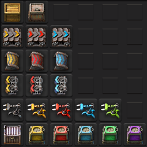

# 🧩 `zzzYAIM0425 0100 sort items`

Este repositorio contiene el MOD `zzzYAIM0425-0100-sort-items`, encargado de **reordenar objetos y recetas** en Factorio siguiendo criterios definidos por el usuario **yaim0425**.

> 🔧 Este MOD depende de [`zzzYAIM0425 0000 lib`](https://github.com/yaim0425/zzzYAIM0425-0000-lib) para funcionar correctamente. Asegúrate de incluirlo como dependencia.

## 📦 Propósito

El objetivo principal es **mejorar la organización** de los objetos y recetas del juego para facilitar la navegación, la estética y la lógica de otros MODs compatibles.

### Beneficios

- Agrupa elementos relacionados  
- Mejora la legibilidad de los menús  
- Establece un orden lógico personalizable  
- Prepara el terreno para futuras integraciones

## 🗃️ Contenido

- Reordenamiento de **ítems** y **recetas**  
- Clasificación personalizada por **categorías y subgrupos**  
- Compatibilidad con otros MODs del ecosistema de yaim0425  
- Soporte para reglas de orden complejas y estructuras compartidas  

## 🧭 Requisitos

- [`zzzYAIM0425 0000 lib`](https://github.com/yaim0425/zzzYAIM0425-0000-lib)  
  Este MOD **es obligatorio** para que la lógica de ordenamiento funcione correctamente.

.png)
.png)
.png)
.png)
